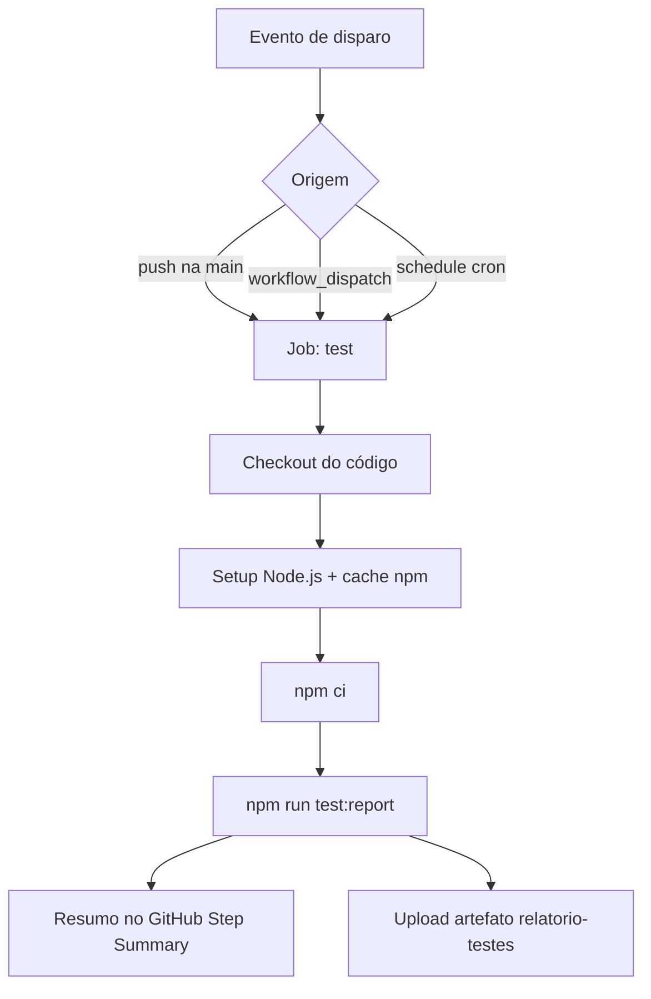

# Pipeline de Integração Contínua — Serviço de Pagamento

Trabalho de conclusão da disciplina **PGATS-26-03** (Integração Contínua). Este repositório contém um projeto desenvolvido em outra disciplina da pós-graduação — um **Serviço de Pagamento** em JavaScript — integrado a uma pipeline de CI com **GitHub Actions**, testes automatizados e geração de relatórios.

## Sobre o projeto de origem

A aplicação modela um serviço que registra pagamentos em memória e permite consultar o último pagamento realizado. Cada pagamento possui código de barras, empresa e valor. Regras de negócio:

- Valor **maior que 100** → categoria `cara`
- Valor **igual ou menor que 100** → categoria `padrão`

### Estrutura do código

| Caminho | Descrição |
| --- | --- |
| `src/servicoDePagamento.js` | Classe `ServicoDePagamento` com métodos `pagar()` e `consultarUltimoPagamento()` |
| `test/servicoDePagamento.test.js` | Suíte de testes automatizados com Mocha e `node:assert` |
| `.github/workflows/pipeline_completa.yaml` | Definição da pipeline de integração contínua |
| `.mocharc.json` | Configuração padrão do Mocha para execução local |

## Como executar localmente

### Pré-requisitos

- [Node.js](https://nodejs.org/) 20 ou superior
- npm

### Instalação

```bash
npm ci
```

### Testes

Execução rápida com saída no terminal:

```bash
npm test
```

Execução com geração de relatório HTML/JSON (mesmo comando usado na pipeline):

```bash
npm run test:report
```

O relatório é salvo em `reports/mochawesome.html` e `reports/mochawesome.json`.

---

## Pipeline de Integração Contínua

A pipeline está definida em [`.github/workflows/pipeline_completa.yaml`](.github/workflows/pipeline_completa.yaml) e implementa os requisitos do trabalho.

### Diagrama de fluxo



### Gatilhos (triggers)

| Gatilho | Configuração | Finalidade |
| --- | --- | --- |
| **Push** | `on.push.branches: [main]` | Valida automaticamente cada alteração enviada à branch principal |
| **Manual** | `on.workflow_dispatch` | Permite disparar a pipeline sob demanda pela aba *Actions* do GitHub |
| **Agendado** | `schedule: cron: '0 6 * * 1'` | Executa toda segunda-feira às 06:00 UTC, garantindo verificação periódica mesmo sem commits |

### Conceitos aplicados

#### Integração Contínua (CI)

Prática de integrar alterações de código com frequência e validá-las automaticamente. Aqui, cada push na `main` dispara testes que garantem que o serviço de pagamento continua funcionando conforme os cenários definidos.

#### GitHub Actions

Plataforma de automação nativa do GitHub. A pipeline é descrita em YAML e executada em **runners** (máquinas virtuais) provisionadas pelo GitHub (`ubuntu-latest`).

#### Workflow, Job e Steps

- **Workflow**: arquivo YAML completo (`pipeline_completa.yaml`)
- **Job** (`test`): unidade de trabalho que roda em um runner
- **Steps**: etapas sequenciais dentro do job (checkout, instalação, testes, upload)

#### Matrix Strategy

A pipeline testa o projeto em **Node.js 20.x e 22.x** simultaneamente, aumentando a confiança de compatibilidade entre versões:

```yaml
strategy:
  matrix:
    node-version: [20.x, 22.x]
```

#### Concorrência

```yaml
concurrency:
  group: ci-${{ github.workflow }}-${{ github.ref }}
  cancel-in-progress: true
```

Evita execuções paralelas redundantes na mesma branch, cancelando runs anteriores ainda em andamento quando um novo push ocorre.

#### Cache de dependências

A action `actions/setup-node@v4` com `cache: npm` reutiliza pacotes entre execuções, reduzindo o tempo de `npm ci`.

#### Artefatos (Artifacts)

Após os testes, o relatório Mochawesome é publicado como **artefato** da execução via `actions/upload-artifact@v4`, com retenção de 30 dias. Para baixar:

1. Acesse **Actions** no repositório
2. Selecione a execução desejada
3. Na seção **Artifacts**, baixe `relatorio-testes-node-20.x` ou `relatorio-testes-node-22.x`
4. Abra `mochawesome.html` no navegador

#### GitHub Step Summary

Um resumo tabular (total, aprovados, reprovados, duração) é escrito em `$GITHUB_STEP_SUMMARY` e exibido na página da execução, facilitando a leitura rápida do resultado sem baixar o artefato.

### Relatório de testes — Mochawesome

O [Mochawesome](https://github.com/adamgruber/mochawesome) é um reporter do Mocha que gera relatórios visuais em HTML e estruturados em JSON. Na pipeline, o script `test:report` é executado:

```bash
npm run test:report
```

Isso produz:

- `reports/mochawesome.html` — relatório visual interativo
- `reports/mochawesome.json` — dados estruturados usados pelo resumo da pipeline

### Execução manual

1. No GitHub, vá em **Actions → Pipeline Completa**
2. Clique em **Run workflow**
3. Opcionalmente informe um motivo no campo de entrada
4. Confirme com **Run workflow**

### Execução agendada

O cron `0 6 * * 1` significa: minuto 0, hora 6, qualquer dia do mês, qualquer mês, segunda-feira. Workflows agendados só rodam se houver atividade recente no repositório (política do GitHub para repositórios inativos).

---

## Cenários de teste cobertos

| # | Cenário | Resultado esperado |
| --- | --- | --- |
| 1 | Pagamento com valor > 100 | Categoria `cara` |
| 2 | Pagamento com valor = 100 (fronteira) | Categoria `padrão` |
| 3 | Pagamento com valor < 100 | Categoria `padrão` |
| 4 | Múltiplos pagamentos | `consultarUltimoPagamento()` retorna o último |

---

## Tecnologias utilizadas

| Ferramenta | Papel |
| --- | --- |
| **JavaScript (ES Modules)** | Linguagem da aplicação |
| **Mocha** | Framework de testes |
| **node:assert** | Asserções nativas do Node.js |
| **Mochawesome** | Geração de relatório HTML/JSON |
| **GitHub Actions** | Orquestração da pipeline de CI |
| **npm ci** | Instalação reprodutível de dependências |

---

## Referências

- [Documentação GitHub Actions](https://docs.github.com/en/actions)
- [Sintaxe de workflow](https://docs.github.com/en/actions/using-workflows/workflow-syntax-for-github-actions)
- [Eventos que disparam workflows](https://docs.github.com/en/actions/using-workflows/events-that-trigger-workflows)
- [Armazenamento de artefatos](https://docs.github.com/en/actions/using-workflows/storing-workflow-data-as-artifacts)
- [Documentação Mocha](https://mochajs.org/)
- [Mochawesome Reporter](https://github.com/adamgruber/mochawesome)
